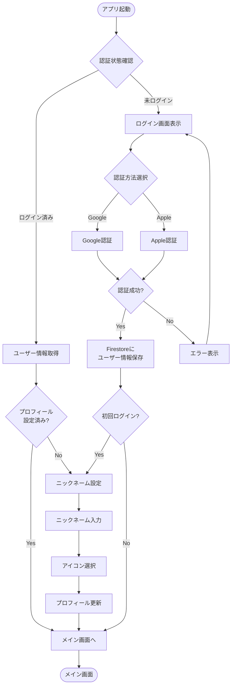
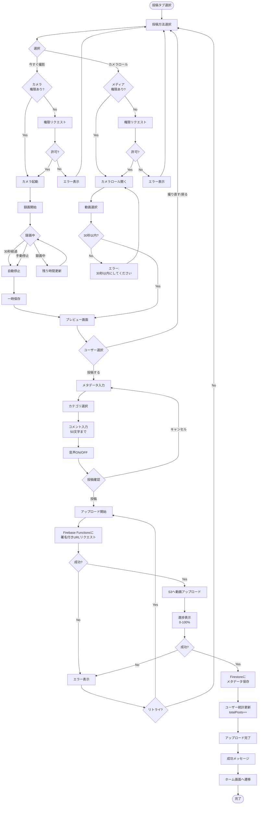
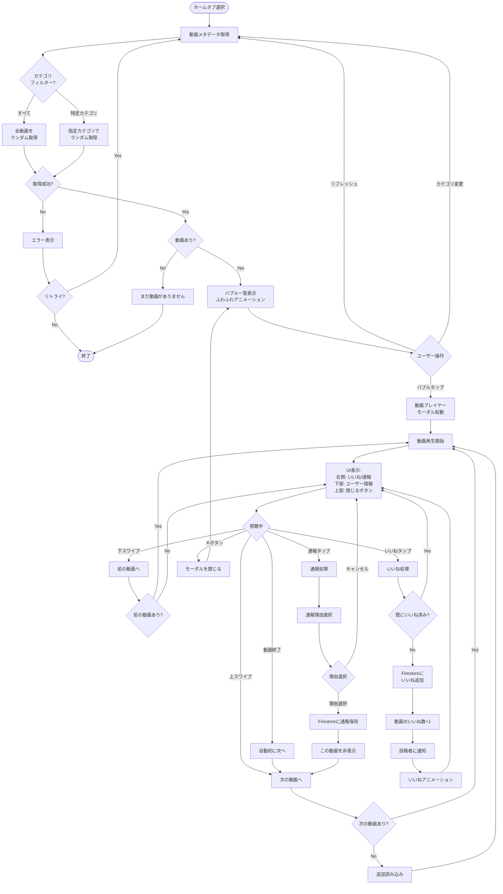
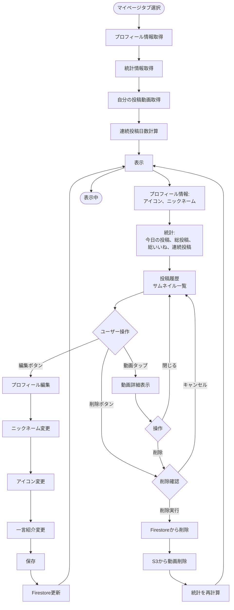
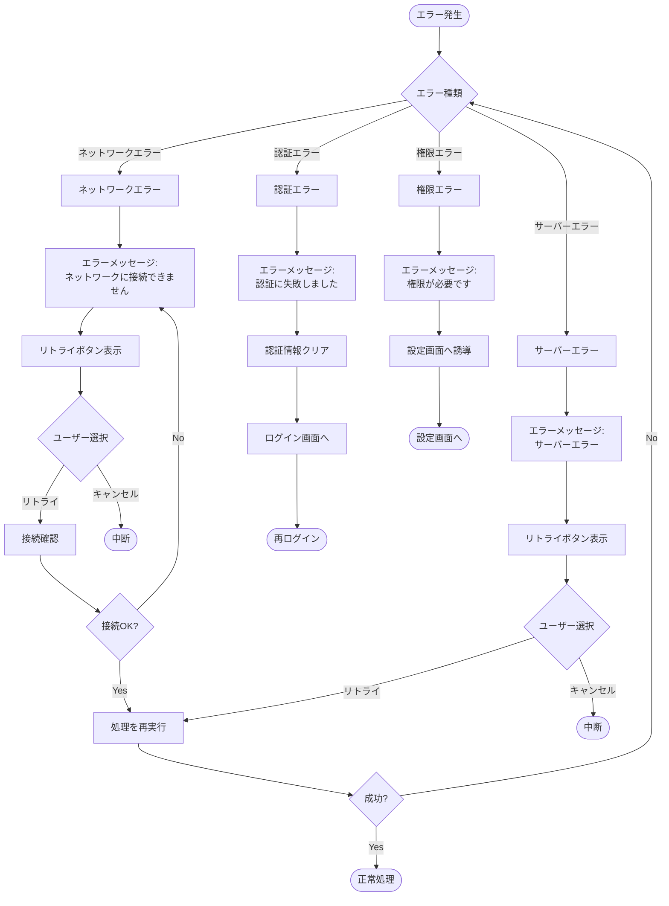
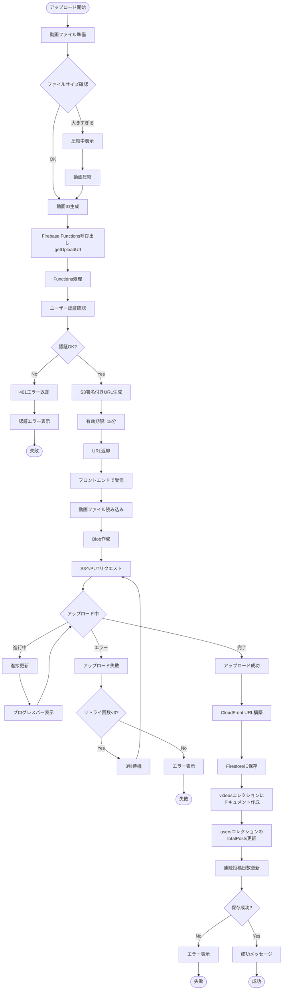

# 主要機能のフローチャート

## 1. ユーザー認証フロー



---

## 2. 動画投稿フロー



---

## 3. 動画視聴フロー（バブルUI）



---

## 4. マイページ表示フロー



---

## 5. プッシュ通知フロー

```mermaid
flowchart TD
    Start([アプリ起動]) --> CheckPermission{通知権限あり?}

    CheckPermission -->|No| RequestPermission[権限リクエスト]
    CheckPermission -->|Yes| GetToken[FCMトークン取得]

    RequestPermission --> Granted{許可?}
    Granted -->|No| SkipNotification[通知機能スキップ]
    Granted -->|Yes| GetToken

    GetToken --> SaveToken[Firestoreに<br/>トークン保存]
    SaveToken --> ListenNotification[通知待機]

    SkipNotification --> End1([通知なし])

    ListenNotification --> TriggerEvent{イベント発生}

    TriggerEvent -->|いいね| LikeEvent[他ユーザーが<br/>いいねをした]
    TriggerEvent -->|リマインダー| ReminderEvent[作業リマインダー<br/>時刻に達した]

    LikeEvent --> CheckSettings1{いいね通知ON?}
    CheckSettings1 -->|No| ListenNotification
    CheckSettings1 -->|Yes| SendLikeNotif[FCM送信:<br/>@ユーザーがいいね]

    ReminderEvent --> CheckSettings2{リマインダーON?}
    CheckSettings2 -->|No| ListenNotification
    CheckSettings2 -->|Yes| SendReminder[FCM送信:<br/>今日まだ投稿してないよ]

    SendLikeNotif --> ShowNotification[通知バナー表示]
    SendReminder --> ShowNotification

    ShowNotification --> UserReaction{ユーザー操作}
    UserReaction -->|タップ| OpenApp[アプリ起動]
    UserReaction -->|無視| ListenNotification

    OpenApp --> DetermineAction{通知種類}
    DetermineAction -->|いいね| NavigateToVideo[該当動画へ遷移]
    DetermineAction -->|リマインダー| NavigateToUpload[投稿画面へ遷移]

    NavigateToVideo --> End2([完了])
    NavigateToUpload --> End2
```

---

## 6. エラーハンドリングフロー



---

## 7. S3アップロードの詳細フロー



---

これらのフローチャートを参考に開発を進めてください！各フローは実際の実装でそのまま使える構造になっています。
