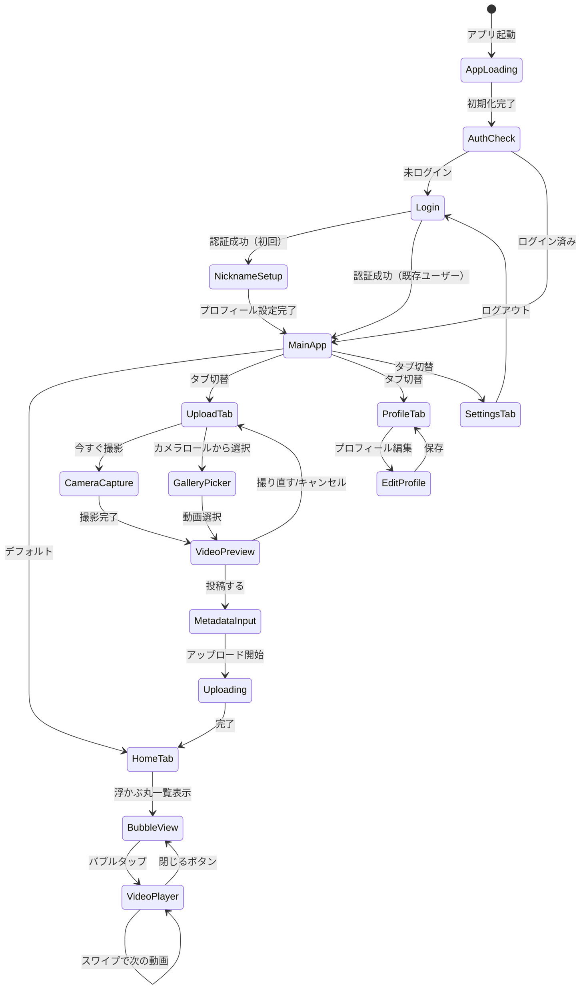
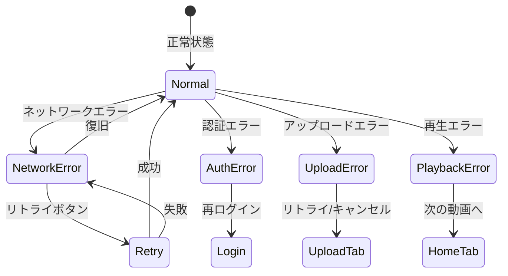

# Scope - アプリ状態遷移図

## 全体の状態フロー



## 画面遷移の詳細

### 1. 起動 → ログイン

```
起動画面
  ↓
認証チェック
  ├─ 未ログイン → ログイン画面
  │               ↓
  │             Google/Apple認証
  │               ↓
  │          ニックネーム設定（初回のみ）
  │               ↓
  └─ ログイン済み → ホーム画面
```

### 2. 動画投稿フロー

```
投稿タブ
  ├─ 今すぐ撮影
  │     ↓
  │   カメラ画面
  │     ↓
  │   撮影（最大30秒）
  │     ↓
  │   プレビュー
  │     ├─ 撮り直す → カメラ画面
  │     └─ 投稿する ↓
  │
  └─ カメラロールから選択
        ↓
      動画選択
        ↓
      プレビュー
        ├─ キャンセル → 投稿タブ
        └─ 投稿する ↓

      メタデータ入力
        - カテゴリ選択
        - コメント入力
        - 音声ON/OFF
        ↓
      アップロード中
        ↓
      完了 → ホーム画面
```

### 3. 動画視聴フロー

```
ホームタブ
  ↓
浮かぶ丸（バブル）一覧画面
  - ふわふわアニメーション
  - カテゴリフィルター
  - 🔄リフレッシュボタン
  ↓
バブルタップ
  ↓
動画プレイヤー（フルスクリーンモーダル）
  ├─ 上スワイプ → 次の動画
  ├─ 下スワイプ → 前の動画
  ├─ 👍タップ → いいね追加
  ├─ ⋯タップ → 通報メニュー
  │     ↓
  │   通報理由選択
  │     ↓
  │   通報完了 → 動画プレイヤー
  └─ ✕ボタン → バブル一覧に戻る
```

### 4. タブ構造

```
MainApp（タブナビゲーター）
  ├─ ホーム（デフォルト）
  │   └─ 動画視聴画面
  │
  ├─ 投稿
  │   ├─ 投稿選択画面
  │   ├─ カメラ画面
  │   ├─ プレビュー画面
  │   └─ メタデータ入力画面
  │
  ├─ マイページ
  │   ├─ 統計表示
  │   ├─ 投稿履歴
  │   └─ プロフィール編集
  │
  └─ 設定
      ├─ 通知設定
      ├─ 利用規約
      └─ ログアウト
```

## 状態管理（Zustand）のストア設計

### authStore
```javascript
{
  user: User | null,
  isAuthenticated: boolean,
  isLoading: boolean,
  login: () => Promise<void>,
  logout: () => Promise<void>
}
```

### videoStore
```javascript
{
  currentVideo: Video | null,
  videos: Video[],
  isLoading: boolean,
  fetchVideos: (category?) => Promise<void>,
  likeVideo: (videoId) => Promise<void>
}
```

### uploadStore
```javascript
{
  isUploading: boolean,
  uploadProgress: number,
  uploadVideo: (video, metadata) => Promise<void>
}
```

### profileStore
```javascript
{
  profile: UserProfile | null,
  stats: UserStats | null,
  myVideos: Video[],
  fetchProfile: () => Promise<void>,
  updateProfile: (data) => Promise<void>
}
```

## エラー状態の処理



## ローディング状態

各画面で必要なローディング表示：

1. **アプリ起動**: スプラッシュスクリーン
2. **認証中**: ログイン画面にスピナー
3. **動画読み込み中**: 動画プレイヤーにスピナー
4. **アップロード中**: プログレスバー（0-100%）
5. **いいね処理中**: ボタンのアニメーション

## 通知の状態遷移

```
バックグラウンド状態
  ↓
FCMトークン受信
  ↓
通知表示
  ├─ タップ → アプリ起動 → 該当動画へ遷移
  └─ 無視 → そのまま
```
